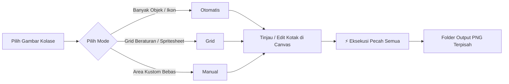

<div align="center">

# ✂️ SnapSlice
### Precision Desktop Image & Sprite Slicer for Windows

[](https://www.python.org/)
[](https://microsoft.com)
[](LICENSE)
[-orange.svg)](#arsitektur--teknologi)
[](#pengujian-otomatis-headless-selftest)

*Aplikasi desktop Windows yang cepat, ringan, dan 100% presisi piksel (lossless) untuk mendeteksi, memotong, dan mengekstrak gambar kolase, kumpulan ikon, dan spritesheet menjadi file gambar terpisah.*

---

</div>

## 📌 Daftar Isi
- [Tentang Proyek](#-tentang-proyek)
- [Fitur Utama](#-fitur-utama)
- [3 Mode Pemotongan](#-3-mode-pemotongan)
- [Navigasi Canvas & Kontrol Zoom](#-navigasi-canvas--kontrol-zoom)
- [Kebutuhan Sistem & Instalasi](#-kebutuhan-sistem--instalasi)
- [Panduan Penggunaan Cepat](#-panduan-penggunaan-cepat)
- [Daftar Shortcut & Kontrol Mouse](#-daftar-shortcut--kontrol-mouse)
- [Pengujian Otomatis (Headless Selftest)](#-pengujian-otomatis-headless-selftest)
- [Keamanan Data & Manajemen Sesi](#-keamanan-data--manajemen-sesi)
- [Solusi Masalah Umum (FAQ / Troubleshooting)](#-solusi-masalah-umum-faq--troubleshooting)
- [Struktur File Repositori](#-struktur-file-repositori)

---

## 📖 Tentang Proyek

**SnapSlice** dirancang untuk kebutuhan desainer, game developer, pembuat stiker, dan digital archivist yang membutuhkan alat pemotong kolase/spritesheet yang **cepat, akurat, dan tidak merusak kualitas asli gambar**.

### Mengapa SnapSlice?
* **100% Lossless**: Data piksel hasil potongan disalin langsung dari gambar asli tanpa kompresi tambahan, tanpa resize paksa, dan tanpa penurunan warna.
* **Ringan & Bebas Dependensi Berat**: Dibangun menggunakan antarmuka native Tkinter dengan komputasi berbasis **Pillow + NumPy**. Tanpa OpenCV, tanpa PyTorch/TensorFlow (menghemat RAM dan tanpa download berukuran gigabyte).
* **Akurasi 0-Piksel**: Sistem konversi koordinat dua arah (*bidirectional canvas-to-image mapping*) menjamin posisi crop akurat hingga satuan piksel terlepas dari tingkat perbesaran (*zoom level*) atau posisi geser (*pan*).
* **Non-Destruktif**: Tidak pernah mengubah atau menimpa (*overwrite*) gambar sumber asli.

---

## ⚡ Fitur Utama

- **Dual-Engine Auto Detection**:
  - *Mode Alpha*: Mendeteksi objek berlatar transparan secara instan berdasarkan ambang batas kanal Alpha.
  - *Mode Warna*: Mendeteksi objek pada latar warna solid melalui estimasi warna keliling gambar (*border perimeter sampling*) dan toleransi Euclidean.
- **Eksekusi 1-Klik (`⚡ Eksekusi Pecah Gambar`)**: Tombol eksekusi terintegrasi langsung di setiap panel kontrol untuk memproses deteksi dan penyimpanan potongan PNG sekaligus.
- **Pembersihan Piksel Tetangga (*Clean Neighbors*)**: Pada gambar beralpha, piksel asing milik objek bersebelahan diubah menjadi transparan penuh saat diekspor.
- **Alur Kerja Interaktif**:
  - **Tool Tangan / Hand (`H`)**: Geser posisi canvas secara leluasa dengan drag tombol kiri mouse.
  - **Tool Kotak / Seleksi (`V`)**: Gambar, pilih, pindahkan, atau resize kotak potongan dengan 8 titik handle.
  - **Slider Zoom Presisi**: Perbesaran halus 10% hingga 500%, tombol 1:1 (100%), dan Pas Layar (*Fit to Window*).
- **Penamaan Cerdas & Anti-Collision**: Format output `<awalan>_001.png` dengan penomoran berdasarkan urutan baca alami (kiri-ke-kanan, atas-ke-bawah). Jika folder atau file sudah ada, sistem otomatis memberi suffix `_2`, `_3`, dst.
- **Penyelamat Sesi & Undo 30 Langkah**: Dilengkapi riwayat pembatalan (Undo/Redo) 30 level serta autosave sesi atomic dengan 5 file rotasi cadangan (`.bak1` – `.bak5`).

---

## 🎯 3 Mode Pemotongan



### 1. Mode Otomatis (Automatic Detection)
Algoritma pendeteksi berbasis komponen terhubung 8-arah (*Connected-Component Labeling*) menggunakan *Run-Length Encoding (RLE)* dan *Union-Find*:
* **Toleransi Warna (0–100)**: Selisih toleransi perbedaan warna objek terhadap warna background.
* **Jarak Gabung / Dilation (0–20 px)**: Menyatukan bagian objek yang terpisah (misal: ikon dengan titik atau aksen terpisah) agar tetap menjadi 1 kesatuan potongan.
* **Ukuran Minimum (1–500 px)**: Menyaring dan membuang serpihan noise kecil secara otomatis.
* **Padding (0–100 px)**: Menambahkan ruang ekstra di sekeliling kotak potongan.
* **Ambang Alpha (1–254)**: Batas deteksi opasitas piksel pada gambar berformat PNG/RGBA.
* **Gabung Kotak 90%**: Otomatis menggabungkan kotak jika satu kotak terkandung $\ge 90\%$ di dalam kotak lain.
* **Eyedropper**: Tombol pemilih warna latar manual langsung dari canvas jika warna tepi tidak homogen.

### 2. Mode Grid (Geometric Grid)
Sangat cocok untuk spritesheet game, lembar stiker simetris, atau kolase foto beraturan:
* Mengatur **Baris** dan **Kolom** secara fleksibel.
* Mendukung pengaturan **Margin** (jarak dari tepi) dan **Gap** (jarak antar sel potongan).
* Menggunakan kalkulasi posisi kumulatif bilangan riil (*float cumulative rounding*) untuk mencegah akumulasi deviasi piksel.

### 3. Mode Manual (Interactive Slicing)
* Buat kotak potongan baru dengan men-drag tombol kiri mouse pada area canvas.
* Geser kotak dengan drag bagian dalam kotak.
* Ubah dimensi ukuran secara akurat menggunakan 8 titik handle (sudut dan tepi).
* Geser presisi per 1 piksel dengan tombol panah keyboard (atau 10 piksel dengan `Shift + Panah`).

---

## 🔍 Navigasi Canvas & Kontrol Zoom

SnapSlice menyediakan toolbar navigasi terintegrasi di bagian atas canvas:

| Elemen Navigasi | Fungsi & Cara Kerja | Shortcut |
| :--- | :--- | :---: |
| **`✂️ Kotak (V)`** | Mengaktifkan mode manipulasi kotak (buat, pindahkan, ubah ukuran). | <kbd>V</kbd> |
| **`✋ Geser / Hand (H)`** | Mengaktifkan mode tangan: drag kiri mouse untuk menggeser gambar bebas. | <kbd>H</kbd> |
| **`🔍−` / `🔍＋`** | Memperkecil atau memperbesar tampilan bertahap. | <kbd>-</kbd> / <kbd>+</kbd> |
| **Slider Zoom** | Mengatur tingkat perbesaran secara mulus dari 10% hingga 500%. | — |
| **`100%`** | Mengembalikan perbesaran ke rasio piksel asli 1:1. | <kbd>1</kbd> |
| **`⊡ Pas Layar`** | Menyesuaikan tampilan gambar agar pas penuh dengan jendela canvas (*Fit*). | <kbd>0</kbd> |
| **Space + Drag** | Cara cepat menggeser tampilan canvas kapan saja tanpa mengganti tool. | <kbd>Spasi</kbd> |

---

## 💻 Kebutuhan Sistem & Instalasi

### Persyaratan
* **Sistem Operasi**: Windows 10 atau Windows 11 (64-bit direkomendasikan).
* **Python**: Versi 3.9 ke atas (termasuk Python 3.10, 3.11, 3.12, 3.13, dan 3.14).
* **Pustaka Python**:
  * `Pillow >= 10.0`
  * `numpy >= 1.23`
  * `tkinter` (bawaan resmi instalasi Python Windows).

### Langkah Instalasi

1. **Clone Repositori**:
   ```bash
   git clone https://github.com/rzjuliannofficial/SnapSlice.git
   cd SnapSlice
   ```

2. **Pasang Dependensi**:
   ```bash
   pip install -r requirements.txt
   ```

3. **Jalankan Aplikasi**:
   * **Cara 1 (Windows 1-Klik)**: Klik dua kali file [`JALANKAN.bat`](file:///c:/Users/lianb/Downloads/Pecah%20gambar/JALANKAN.bat). Script akan otomatis memvalidasi Python, mengecek dependensi, dan membuka aplikasi.
   * **Cara 2 (Terminal / CMD)**:
     ```bash
     python SnapSlice.py
     ```

---

## 🚀 Panduan Penggunaan Cepat

1. **Buka Gambar**:
   * Klik tombol **Buka Gambar** (file picker native Windows) atau paste path file ke kolom input lalu klik **Muat**.
   * Format didukung: `PNG`, `JPG/JPEG`, `WEBP`, `BMP`, `TIF/TIFF`.
2. **Pilih Mode Potong**:
   * Pilih antara **Manual**, **Grid**, atau **Otomatis** pada panel kanan.
3. **Konfigurasi & Tinjau Kotak**:
   * Pada mode **Otomatis**, klik **Deteksi Otomatis** untuk melihat kotak hasil pemindaian.
   * Koreksi ukuran atau posisi kotak pada canvas bila diperlukan.
4. **Eksekusi Pemecahan Gambar**:
   * Klik tombol **`⚡ Eksekusi Pecah Gambar`** (pada panel mode) atau **`⚡ Eksekusi Pecah Semua (Simpan)`** (pada bilah bawah).
   * Potongan gambar akan langsung disimpan ke folder tujuan dalam format PNG lossless.
   * Setelah selesai, aplikasi menampilkan konfirmasi dan opsi langsung membuka folder output.

---

## ⌨️ Daftar Shortcut & Kontrol Mouse

| Tombol / Aksi | Fungsi |
| :--- | :--- |
| <kbd>Ctrl</kbd> + <kbd>O</kbd> | Membuka dialog pemilih gambar |
| <kbd>Ctrl</kbd> + <kbd>E</kbd> | Eksekusi simpan (ekspor) semua kotak ke folder output |
| <kbd>Ctrl</kbd> + <kbd>Z</kbd> | Undo perubahan kotak (hingga 30 langkah) |
| <kbd>Ctrl</kbd> + <kbd>Y</kbd> | Redo perubahan kotak |
| <kbd>Ctrl</kbd> + <kbd>A</kbd> | Memilih seluruh kotak |
| <kbd>Esc</kbd> | Membatalkan pilihan kotak / membatalkan eyedropper |
| <kbd>Delete</kbd> | Menghapus kotak yang sedang dipilih |
| <kbd>H</kbd> | Mengaktifkan Tool Tangan / Geser (*Hand Tool*) |
| <kbd>V</kbd> | Mengaktifkan Tool Kotak / Seleksi (*Select Tool*) |
| <kbd>+</kbd> / <kbd>=</kbd> | Memperbesar tampilan canvas (*Zoom In*) |
| <kbd>-</kbd> | Memperkecil tampilan canvas (*Zoom Out*) |
| <kbd>0</kbd> | Menyesuaikan tampilan pas ke jendela (*Fit to Window*) |
| <kbd>1</kbd> | Mengatur zoom 100% (1:1 ukuran piksel asli) |
| <kbd>Panah</kbd> | Menggeser kotak terpilih sebesar 1 piksel |
| <kbd>Shift</kbd> + <kbd>Panah</kbd> | Menggeser kotak terpilih sebesar 10 piksel |
| <kbd>F1</kbd> | Menampilkan dialog bantuan dan panduan shortcut |
| <kbd>Ctrl</kbd> + **Scroll Mouse** | Zoom masuk/keluar berpusat pada posisi kursor |
| **Klik Tengah Drag** | Menggeser posisi canvas (*Pan*) |
| <kbd>Spasi</kbd> + **Drag Kiri** | Menggeser posisi canvas (*Pan*) |

---

## 🧪 Pengujian Otomatis (Headless Selftest)

SnapSlice dilengkapi dengan fitur pengujian mandiri tanpa GUI (*headless test suite*) untuk memastikan seluruh logika matematika koordinat, algoritma deteksi, serta mekanisme ekspor berjalan 100% sempurna:

```bash
python SnapSlice.py --selftest
```

**Cakupan Pengujian:**
1. Pembuatan gambar kolase sintetis latar putih solid dan latar transparan RGBA.
2. Deteksi komponen terhubung 9 dari 9 objek sintetis.
3. Pembagian simetris mode Grid 3x4 tanpa akumulasi selisih piksel.
4. *Roundtrip coordinate mapping* (Image $\leftrightarrow$ Canvas) dengan toleransi deviasi 0 piksel.
5. Mekanisme ekspor *lossless* tanpa *overwrite* (suffix `_2`, `_3`).
6. Verifikasi integritas hash file gambar sumber (gambar asli terbukti tidak berubah).

---

## 🛡️ Keamanan Data & Manajemen Sesi

* **Autosave Sesi**: Setiap perubahan kotak otomatis disimpan ke folder `sesi/<hash>.json` dengan jeda debounce 1 detik. `<hash>` dihitung dari path absolut, ukuran file, dan waktu modifikasi.
* **Penulisan Berkas Atomic**: Penulisan sesi dan ekspor gambar dilakukan ke file sementara (`.tmp`) terlebih dahulu sebelum diganti namanya secara atomik, melindungi data dari risiko kerusakan jika listrik padam atau aplikasi tertutup tiba-tiba.
* **Rotasi Backup 5 Salinan**: Menyimpan 5 riwayat sesi terakhir (`.bak1` s/d `.bak5`).
* **Proteksi File Asli**: Gambar sumber dibuka dalam mode *read-only*. File yang sudah ada tidak pernah ditimpa, melainkan diberikan penomoran baru otomatis.

---

## ❓ Solusi Masalah Umum (FAQ / Troubleshooting)

> [!TIP]
> **Objek bergambar tidak terdeteksi pada gambar dengan latar belakang kompleks?**
> Sistem deteksi warna otomatis bekerja paling optimal pada gambar dengan latar belakang relatif homogen atau transparan. Jika latar belakang memiliki gradasi atau foto:
> 1. Gunakan tombol **`Ambil warna background`** (Eyedropper) dan klik area latar belakang pada canvas.
> 2. Naikkan slider **Toleransi Warna** (misal ke 45–60).
> 3. Jika gambar merupakan susunan rapi, gunakan **Mode Grid**.
> 4. Jika objek tidak beraturan pada foto, gunakan **Mode Manual** untuk menandai kotak dengan mouse.

> [!NOTE]
> **Bilah tombol bawah terpotong di layar laptop?**
> SnapSlice sudah dilengkapi sistem docking fleksibel (`side="bottom"`). Jika jendela terasa sempit, klik tombol *Maximize* pada jendela atau gunakan perbesaran pas layar (<kbd>0</kbd>).

> [!IMPORTANT]
> **Python tidak terdeteksi saat menjalankan `JALANKAN.bat`?**
> Pastikan saat menginstal Python dari [python.org](https://www.python.org/downloads/), Anda mencentang opsi **"Add python.exe to PATH"** dan mencentang komponen **"tcl/tk and IDLE"**.

---

## 📁 Struktur File Repositori

```text
SnapSlice/
├── SnapSlice.py        # Kode utama aplikasi (GUI Tkinter, Engine Deteksi, Ekspor)
├── requirements.txt    # Daftar dependensi resmi (Pillow, numpy)
├── JALANKAN.bat        # Script peluncur otomatis 1-klik untuk Windows
├── README.md           # Dokumentasi lengkap repositori (Format GitHub)
├── README.txt          # Panduan teks lokal ringkas
└── .gitignore          # Konfigurasi pengabaian file cache & data runtime
```

*File yang dibuat otomatis saat aplikasi berjalan (diabaikan oleh git):*
* `pengaturan.json` — Konfigurasi folder lokal terakhir pengguna.
* `log_error.txt` — Catatan diagnostik error teknis.
* `sesi/` — Penyimpanan sesi dan file backup otomatis.

---

## 📄 Lisensi

Didistribusikan di bawah lisensi **MIT License**. Bebas digunakan, dimodifikasi, dan didistribusikan untuk keperluan pribadi maupun komersial.

<div align="center">
<b>Dibuat untuk efisiensi dan presisi ekstraksi aset digital di Windows.</b>
</div>
